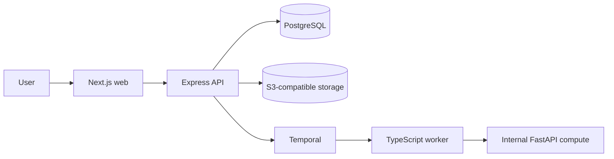

<!--
SPDX-FileCopyrightText: 2026 TraceGuard contributors
SPDX-License-Identifier: Apache-2.0
-->

# System architecture overview

## Purpose

TraceGuard coordinates evidence-backed investigation, recall planning, approval, execution, recovery measurement, and CAPA learning for independently isolated organizations.

## Accepted shape

The system begins as a modular monolith with two specialized process types: a Temporal worker and an internal Python compute service. Domain modules are not split into independent microservices without measured operational evidence and an accepted architecture decision.

## Ownership boundaries

- The Express API is the only public business backend and the only process that authorizes and persists business-state transitions.
- The web application never connects directly to PostgreSQL or the internal compute service and does not own approval or recall policy.
- Temporal coordinates durable work but does not own authoritative business state or authorization.
- The Python service performs bounded analytical tasks, returns versioned advisory results, and never approves or executes a recall.
- PostgreSQL is the system of record. Valkey may cache or throttle but never owns business state.

## Cross-cutting invariants

1. Every tenant-owned record and operation carries explicit tenant context.
2. Consequential actions require deterministic policy checks and configured human approval.
3. Evidence, decisions, policies, plans, and analytical methods retain the versions used at decision time.
4. Important state transitions record actor, reason, time, correlation, and an append-only audit event.
5. Retried activities do not duplicate external consequences.
6. Missing data remains unknown rather than being interpreted as safe.

## Approved technology

| Area | Technology |
| --- | --- |
| Repository | pnpm workspaces and Turborepo |
| Web | Next.js, TypeScript, Tailwind CSS, shadcn/ui |
| API | Express, TypeScript, REST, OpenAPI 3.1 |
| Data | PostgreSQL, Drizzle, pgvector, PostGIS |
| Workflow | Temporal TypeScript SDK |
| Compute | Python, FastAPI, Pydantic, uv |
| Identity | Keycloak through OIDC/OAuth 2.0 |
| Local environment | Docker Compose and `just` |
| Telemetry | OpenTelemetry, Prometheus, Grafana, Loki |
